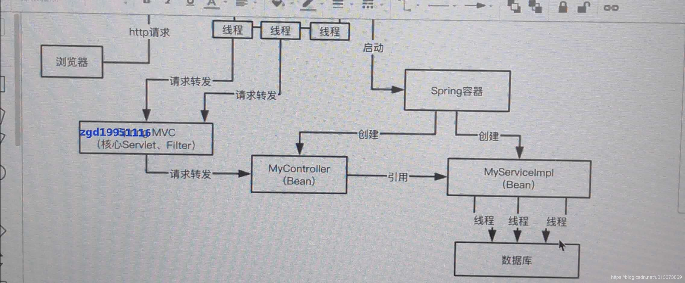

### 01.说说你对Spring的IOC机制的理解可以嘛？

**程序的耦合和解耦   IOC叫控制反转其目的就是为了降低程序的耦合性**，使类与类之间彻底的解耦合（现在这套比较高大.上的一点系统里，有几十个类都使用了@Resource或者@Autowired这个注解去标注MyService  myService， 几十个地方都依赖了这个类，如果要修改实现类为NewServiceManagerlmpl，此时只需要将MyService中注解@Service加到NewServiceManagerlmpl中即可 ），不是什么技术，而是一种设计思想。**在Java开发中，**Ioc意味着将你设计好的对象交给容器控制，而不是传统的在你的对象内部直接控制。比如，某个实现类注解@Service  而控制层代码

```java
@Autowired
private IAccountCustomerService accountCustomerService;
```

此时就会把service注入到控制层中。


### 02.说说你对spring的AOP机制的理解？

AOP(Aspect-Oriented Programming:面向切面编程)能够将那些与业务无关，却为业务模块所共同调用的逻辑或责任(例如事务处理、日志管理、权限控制等)封装起来，便于减少系统的重复代码，降低模块间的耦合度，并有利于未来的可拓展性和可维护性。

### 03.了解过cglib动态代理吗？他跟jdk动态代理的区别是什么？

### 动态的代理的特点

#### 动态代理的两种实现方式
#### 基于接口的动态代理

基于子类的动态代理
两者之间的区别

### 04.能说说Spring中的Bean是线程安全的吗？

**Spring中的bean的作用域有哪些?**
● singleton:唯一bean实例，Spring中的bean默认都是单例的。
● prototype :每次请求都会创建一一个 新的bean实例。
● request:每一次HTTP请求都会产生-一个新的bean，该bean仅 在当前HTTP request内有效。
●session:每一次HTTP请求都会产生一个新的bean， 该bean仅在当前HTTP session内有效。
● global-session:全 局session作用域，仅仅在基于portlet的web应用中才有意义，Spring5已经没有了。Portlet是 能够生成语义代码(例如: HTML)片段的小型ava Web插件。它们基于portlet容器，可以像servlet- -样处理HTTP请求。但是，与servlet不同，每个portlet都有不同的会话。

大部分时候我们并没有在系统中使用多线程，所以很少有人会关注这个问题。单例bean存在线程问题，主要是因为当多个线程操作同一个对象的时候，对这个对象的非静态成员变量的写操作**会存在线程安全问题**。
常见的有两种解决办法:
1.在Bean对象中尽量避免定义可变的成员变量(不太现实)。
2.在类中定义一个ThreadLocal成员变量，将需要的可变成员变量保存在
ThreadLocal中(推荐的一种方式)




是线程不安全的。spring bean默认来说是单例的，是线程不安全的。但是java web系统中，一般来说很少在spring bean中放一些实例变量，通常都是多个组件互相调用，最终去访问数据库的，所以一般结果就是多个线程并发的访问数据库。

### 05.Spring的事务实现原理是什么？能聊聊你对事务传播机制的理解么？

**事务的实现原理：**如果说你加了一个@Transactional注解，此时spring就会使用AOP的思想，对你的这个方法在执行之前去开启事务，执行完毕之后，根据你方法是否报错，来决定回滚还是提交事务。

**支持当前事务的情况:**
●TransactionDefinition.PROPAGATION_ REQUIRED: 如果当前存在事务， 则加入该事务;如果当前没有事务，则创建一- 个新的事务。
●TransactionDefinition.PROPAGATION_ SUPPORTS: 如果当前存在事务，则加入该事务;如果当前没有事务，则以非事务的方式继续运行。
●TransactionDefinition.PROPAGATION_ MANDATORY: 如果当前存在事务，则加入该事务;如果当前没有事务，则抛出异常。(mandatory: 强制性)

**不支持当前事务的情况:**
●TransactionDefinition.PROPAGATION_ REQUIRES_ NEW:创建一一个新的事务，如果当前存在事务，则把当前事务挂起。
●TransactionDefinition.PROPAGATION_ NOT_ SUPPORTED: 以非事务方式运行，如果当前存在事务，则把当前事务挂起。
●TransactionDefinition.PROPAGATION_ NEVER: 以非事务方式运行，如果当前存在事务，则抛出异常。
**其他情况**（嵌套：方法A调用方法B, 如果B出错，方法B只能回滚他自己，方法A则会可以带着方法B一起回滚，NESTED嵌套事务。）:
●TransactionDefinition.PROPAGATION_ NESTED: 如果当前存在事务，则创
建一个事务作为当前事务的嵌套事务来运行;如果当前没有事务，则该取值等价于
TransactionDefinition.PROPAGATION_ REQUIRED。

### 06.画一张图说说spring boot的核心框架？

 

### 07.能说说Spring中使用了哪些设计模式吗？

### 08.能说说Spring中使用了哪些设计模式吗？

### 09.能说说Spring中使用了哪些设计模式吗？

###  10.能画一张图说一说springMvc的核心架构么？


